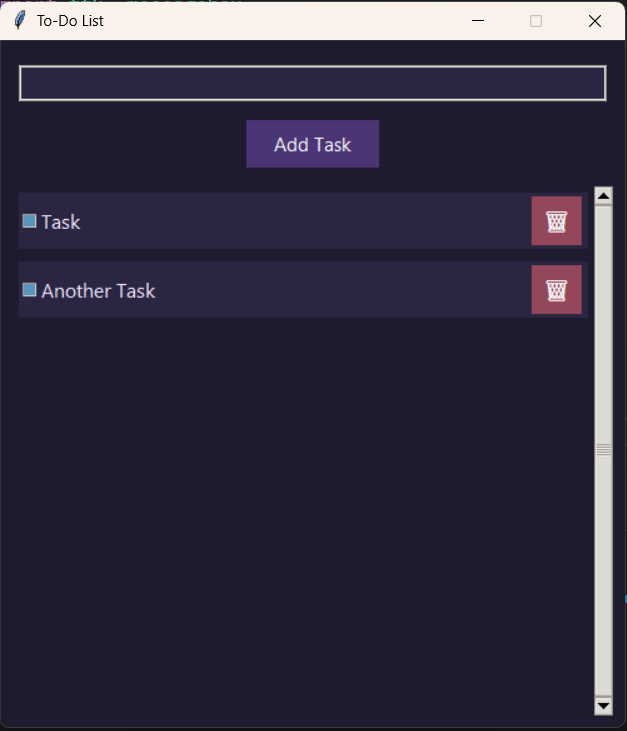

# 📝 Tkinter To-Do List

A stylish and minimal to-do list desktop app built with **Python** and **Tkinter**.  
Easily add, complete, and delete tasks with persistence — even after closing the app.

---

## ✨ Features

- ✅ **Add tasks** using button or pressing `Enter`
- 🗑 **Delete tasks** with a neat square emoji button
- 📌 **Mark tasks as done** with a strikethrough style
- 💾 **Saves tasks** automatically in a local JSON file
- 🖱️ **Scroll support** for long task lists
- 🎨 Beautiful modern UI using `ttk.Style` and custom themes

---

## 📸 Screenshots


### 🔧 Requirements
- Python 3.x (Recommended: 3.8+)
- No external libraries required (only `tkinter`, which is built-in)

### 🛠️ How to Run

```bash
python main.py